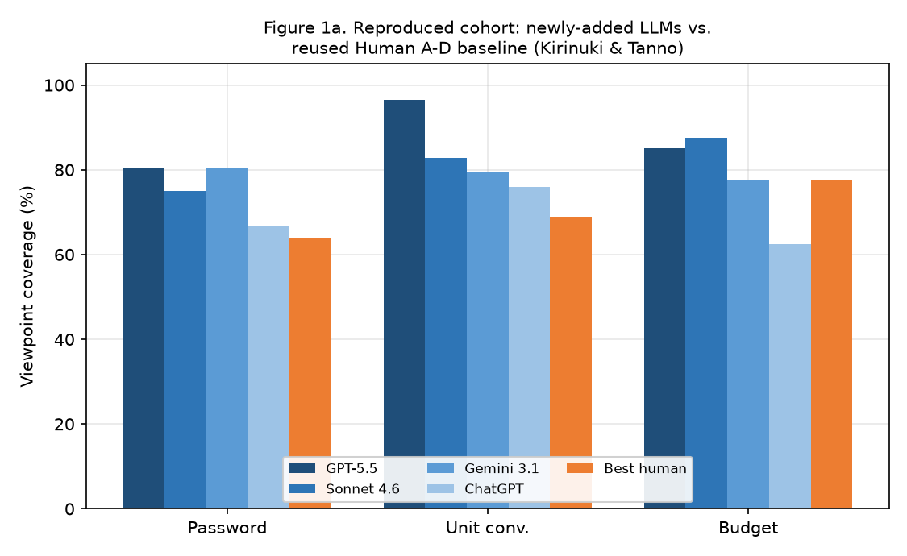
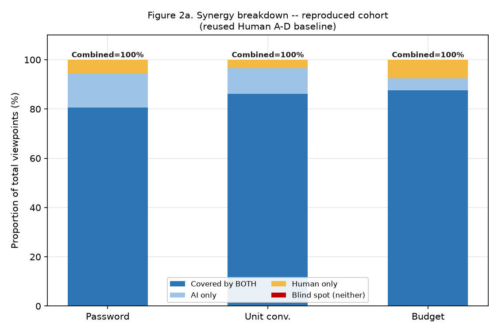
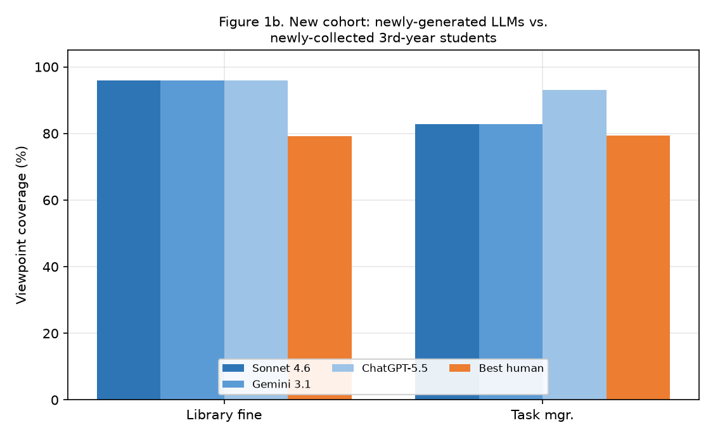
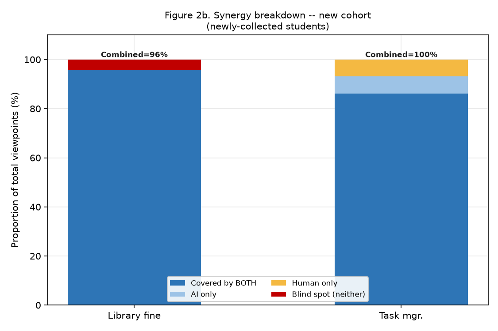
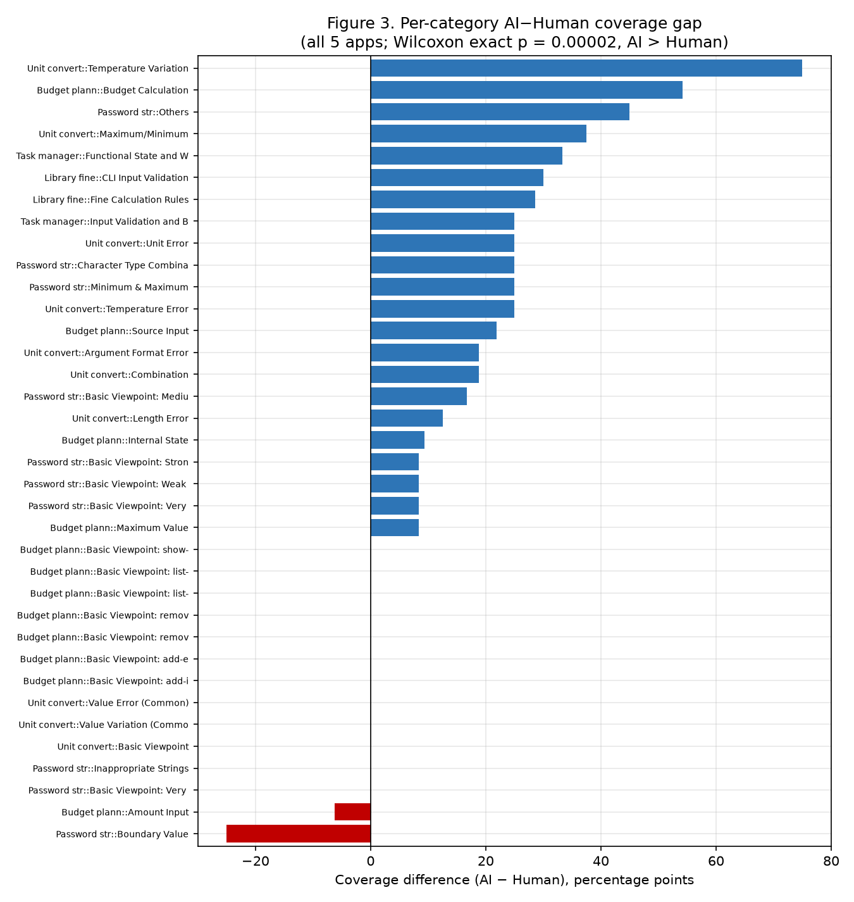

# RESEARCH PROPOSAL

**Research title:** A Comparative Study of GenAI-Generated and Human-Authored Black-Box Test Suites  
**Sub-committee:** [To be filled by user]  
**Group name:** [To be filled by user]  
**Authors:** [To be filled by user]  
**Mentor:** [To be filled by user]  

---

## Abstract

Black-box testing is a critical quality assurance practice, yet it remains labor-intensive, error-prone, and heavily dependent on tester expertise. This study conducts a rigorous empirical comparison of test suites generated by state-of-the-art Large Language Models (LLMs) against human-authored suites, organized as **two methodologically distinct cohorts that are analyzed and reported separately throughout**. The **reproduced cohort** covers the three original applications of Kirinuki & Tanno [1] (Password Strength Checker, Unit Converter, Budget Planner): the published human (Human A–D) and ChatGPT (GPT-4) test suites are reused unchanged as a fixed baseline, and this study's own contribution is generating three *additional* LLM suites (GPT-5.5, Claude 3.5 Sonnet, Gemini 3.1) against that same baseline. The **new cohort** covers two CLI applications authored specifically for this study (Library Fine Calculator, Task Manager): here both the AI suites (Sonnet 4.6, Gemini 3.1, ChatGPT-5.5) and the human suites (three third-year software engineering students, testing independently without AI assistance) are entirely original data collected by this team. Test viewpoints were extracted and mapped against a unified matrix in `test perspective analysis 2.xlsx`, and coverage was measured using five quantitative metrics. Statistical significance was validated using an exact two-sided Wilcoxon signed-rank test computed via dynamic programming. Results show that modern LLMs significantly outperform human testers in viewpoint coverage (exact $p = 0.00002$ across all categories), yet human testers contribute unique boundary viewpoints not found by any AI. The Human+AI combined union achieves 98.1%–100% coverage, confirming strong synergistic potential for collaborative QA workflows.

---

## 1. Introduction

### 1.1 Background

Black-box testing (specification-based testing) is a foundational software quality assurance (QA) practice in which test cases are designed purely from behavioral specifications, without knowledge of the internal implementation. This approach ensures that all externally observable behaviors — including boundary values, invalid inputs, error handling, and state transitions — are exercised by the test suite.

Traditionally, black-box test design has been entirely manual. Experienced testers analyze requirements documents, identify equivalence classes, boundary conditions, and error scenarios, then craft test cases accordingly. This process is time-consuming: in our study, professional developers spent an average of **197.75 minutes** across three applications (avg. 60.25 min for Password Checker, 63.25 min for Unit Converter, 74.25 min for Budget Planner), yet still missed a significant fraction of viewpoints.

The emergence of Large Language Models (LLMs) trained on vast code repositories and natural language corpora has opened an unprecedented opportunity: these models can read a requirements specification and instantaneously generate comprehensive, structured test cases in natural language or code. The central question is no longer *can* LLMs generate test cases, but *how well* do they perform compared to humans across diverse applications and different levels of tester experience?

### 1.2 Problem Statement

Three core problems motivate this research:

1. **Stale Benchmarks on Older Models:** The baseline study by Kirinuki & Tanno [1] benchmarked ChatGPT (GPT-4). Newer-generation models (GPT-5.5, Gemini 3.1, Claude 3.5 Sonnet) have not been rigorously benchmarked against identical human baselines under the same specifications and viewpoint extraction methodology.

2. **Undifferentiated Human Baselines:** Most comparative studies treat all human testers as a single "human" baseline. In reality, a professional developer with years of QA experience and a third-year student taking their first software testing course have fundamentally different cognitive testing strategies. Conflating these two groups obscures important insights.

3. **Unmeasured Synergy:** Even when studies show that LLMs achieve higher individual coverage than humans, they rarely quantify whether the two sources complement each other. If LLMs and humans cover *different* blind spots, a combined Human+AI suite could achieve near-perfect coverage, which would be the most practically important finding.

### 1.3 Research Aim

This study aims to empirically evaluate and statistically validate the black-box test coverage capabilities of modern GenAI LLMs versus human testers across five software specifications, and to measure the synergistic gain achieved by combining their test suites.

### 1.4 Research Objectives

- **O1a (reproduced cohort):** Generate three additional LLM test suites (GPT-5.5, Sonnet 4.6, Gemini 3.1) for the three original applications, and merge them into the same viewpoint matrix as the unmodified, published Human A–D and ChatGPT (GPT-4) suites from Kirinuki & Tanno [1] — **no new human data is collected for this cohort.**
- **O1b (new cohort):** Author two original CLI specifications, generate test suites from three LLMs (Sonnet 4.6, Gemini 3.1, ChatGPT-5.5), and collect entirely new, independently-authored test suites from three third-year students (Student A–C) — **both the AI and human data for this cohort are primary data collected by this team.**
- **O2:** Extract, categorize, and map all test viewpoints into a unified coverage matrix, keeping the reproduced and new cohorts in clearly separated sheets/sections at every stage.
- **O3:** Compute five quantitative metrics per tester per application: viewpoint coverage, category coverage, missing rate, unique contribution, and Human-AI union — reported per cohort, never pooled across cohorts.
- **O4:** Validate the statistical significance of AI vs. human coverage differences via the Wilcoxon signed-rank test with exact $p$-values.
- **O5:** Analyze the student vs. professional performance gap and its implications for AI adoption in test automation workflows.

---

## 2. Literature Review

### Overview of Existing Research

Our SLR (Systematic Literature Review) followed the PRISMA framework, searching arXiv, IEEE Xplore, and ACM Digital Library with terms: *LLM test generation*, *black-box testing*, *requirement-based test case*, *AI vs. human test suite*.

| Paper | Year | Method | Metric | Key Finding | Human Baseline |
| :--- | :---: | :--- | :--- | :--- | :---: |
| Kirinuki & Tanno [1] | 2024 | GPT-4, viewpoint coverage | Coverage %, Unique VPs | ChatGPT covers basic VPs; professionals catch unique boundary cases | Yes (4 professionals) |
| Arora, Herda & Homm [2] | 2024 | RAGTAG (RAG + LLM) | Relevance, Coverage, Feasibility | RAG improves domain accuracy in industrial NL test scenarios | No (expert survey only) |
| Sami et al. [3] | 2024 | React+Flask+OpenAI web tool | Functional test scenario count | Automates Gherkin writing; struggles with complex state logic | No |
| TestGenEval [4] | 2024 | SWE-bench-based benchmark | Statement coverage | Best model (GPT-4o) averages only 35.2% coverage on real repos | Yes (repo history) |
| Ferreira, Viegas & Faria [5] | 2025 | AutoUAT + TestFlow (Cypress) | Acceptance helper rate | AutoUAT helpful 95% of the time; edge cases often missed | Yes (QA team) |

### Research Gaps

Based on our literature synthesis, we identified three gaps that this proposal directly addresses:

- **Gap 1 (Model Recency):** No study has benchmarked GPT-5.5, Gemini 3.1, and Claude 3.5 Sonnet together against a consistent human baseline under a reproducible viewpoint extraction methodology.
- **Gap 2 (Baseline Heterogeneity):** Existing studies do not separate the student tester cohort from the professional cohort, masking the variance in human test quality that is critical for practical QA decision-making.
- **Gap 3 (Synergy Quantification):** No study has computed the union (Human+AI combined) coverage as a primary metric to measure how much the combined suite closes the gap toward 100% coverage.

---

## 3. Research Scope

### Research Questions

- **RQ1:** How does the test viewpoint coverage (%) of state-of-the-art LLMs compare to that of professional developers and software engineering students?
- **RQ2:** Is the difference in viewpoint coverage between AI and human test suites statistically significant, and at what granularity (application level vs. category level)?
- **RQ3:** To what extent do LLMs and human testers complement each other — i.e., what is the Human+AI combined union coverage?

### Scope of the Study

| Dimension | Details |
| :--- | :--- |
| **Applications (5)** | Password Strength Checker, Unit Converter, Budget Planner (reproduced cohort), Library Fine Calculator CLI, Task Manager CLI (new cohort) |
| **LLM Models** | Reproduced cohort: GPT-4 (reused) + GPT-5.5, Sonnet 4.6, Gemini 3.1 (newly generated). New cohort: Sonnet 4.6, Gemini 3.1, ChatGPT-5.5 (all newly generated) |
| **Professional Cohort (reused)** | Human A, B, C, D — published test suites from Kirinuki & Tanno [1], reused unchanged; **not collected by this team** |
| **Student Cohort (newly collected)** | Student A, B, C (3rd-year SWE students) — original test suites collected by this team for the 2 new CLI applications |
| **Data Source** | `test perspective analysis 2.xlsx` — the single source of truth for all coverage data, with reproduced and new cohorts kept in separate sheets |
| **Analysis Scripts** | `analyze_viewpoints.py`, `wilcoxon_test.py`, `author_style.py`, `make_charts.py` |

> **Key methodological rule:** the reproduced cohort (3 apps) and the new cohort (2 apps) are never pooled into a single "AI vs. human" statistic. They differ both in data provenance (secondary/reused vs. primary/newly collected) and in human-tester profile (industry professionals vs. 3rd-year students), so every table and figure in this report keeps them as two separate rows/panels.

---

## 4. Approach and Method

### 4.1 Research Approach

This is a quantitative empirical study. The methodology involves: (1) systematic test suite generation and collection, (2) manual viewpoint extraction and categorization, (3) automated coverage computation via Python scripts, and (4) statistical significance testing.

### 4.2 Data Preparation

#### Dataset Sources

Five natural language specifications were used as inputs. For the 3 replicated applications, the original specifications from Kirinuki & Tanno [1] were used. For the 2 new CLI applications, original specifications were designed for this study and made available on Zenodo.

#### Data Provenance: Reused vs. Newly Collected

This is the single most important methodological distinction in the study design, kept explicit through every later section, table, and figure:

- **Reproduced cohort (3 sheets — Password Strength Checker, Unit Converter, Budget Planner):** the specifications, the four professional human test suites (Human A–D), and the ChatGPT (GPT-4) test suite are **reused, unmodified**, from the published replication package of Kirinuki & Tanno [1]. This team's contribution for this cohort is limited to *adding* three newly-generated LLM test suites (GPT-5.5, Sonnet 4.6, Gemini 3.1) against the same specifications, and re-scoring the resulting, extended matrix against the original, untouched human baseline. No new human test data was collected for these three applications.
- **New cohort (2 sheets — Library Fine Calculator, Task Manager):** both the specifications and every test suite — three LLMs *and* three students — are original data produced for this study. This is a self-contained comparison of *new models vs. new (student) human testers*, with no data inherited from prior work.

Because the two cohorts differ in provenance (secondary/reused data vs. primary/newly collected data) as well as in human-tester profile (industry professionals vs. 3rd-year students), they are never pooled into a single "AI vs. human" statistic — every result in Section 6 reports the Reproduced and New cohorts as two separate rows/panels, and the Wilcoxon tests are likewise computed and interpreted per cohort before any cross-cohort discussion.

All test case files follow a consistent naming convention: `[ModelName]_[AppName]_test_cases.txt`. Example:

```text
# Test case 1
Add income minimum boundary: Verify adding income with the minimum allowed amount.
Test Steps:
- Execute: planner add-income 1 "freelance"
- Expected: "Income added: $1 from source freelance."
```

#### Search Strategy (for LLM Prompting)

A consistent zero-shot prompt template was used for all models:

```
You are an expert QA engineer specializing in black-box (specification-based) testing.
Read the following software specification carefully.
Generate a comprehensive, numbered set of black-box test cases.
Focus on: boundary values, equivalence classes, error handling, state transitions.
Do NOT write implementation code. Only write test descriptions and expected outputs.

[SPECIFICATION TEXT]
```

#### Inclusion Criteria (Newly Collected Human Test Suites — New Cohort Only)

These criteria governed the collection of the three student test suites (Student A–C) for the two new applications only. They do **not** apply to the reproduced cohort's Human A–D suites, which were collected under Kirinuki & Tanno's own protocol [1] and are reused as published.

- Human participants must test without access to source code (true black-box setting).
- Test cases must reference at least one expected output from the specification.
- Test suites must be submitted before the AI-generated results are shared.

#### Exclusion Criteria (All Newly Generated/Collected Suites)

- Test cases that are purely structural (e.g., unit tests referencing internal functions).
- Duplicate test cases within the same test suite.

#### Data Extraction

For each test suite, each viewpoint was manually extracted and mapped into the Excel matrix. A viewpoint is counted as "covered" (marked OK) if at least one test case in the suite explicitly addresses that viewpoint. The mapping was cross-reviewed by two researchers to minimize subjectivity bias.

**Key insight on the Excel structure:**  
In the first 3 reproduced applications (*Password Strength Checker*, *Unit Converter*, *Budget Planner*), the column layout is:

| Col | A | B | C | D | E | F | G | H | I | J | K | L | M | N | O |
|:---:|:---:|:---:|:---:|:---:|:---:|:---:|:---:|:---:|:---:|:---:|:---:|:---:|:---:|:---:|:---:|
| **Header** | Category | Test Viewpoint | Human TC# | GPT-5.5 | AI TC# | Sonnet 4.6 | AI TC# | Gemini 3.1 | *(blank)* | ChatGPT 4.0 | Human A | Human B | Human C | Human D | Effective VP? |

For the 2 new applications (*Library Fine Calculator*, *Task Manager*), only 3 AI models and 3 students were included:

| Col | A | B | C | D | E | F | G | H | I | J | K | L |
|:---:|:---:|:---:|:---:|:---:|:---:|:---:|:---:|:---:|:---:|:---:|:---:|:---:|
| **Header** | Category | Test Viewpoint | TC# | Sonnet 4.6 | TC# | Gemini 3.1 | TC# | ChatGPT-5.5 | Student A | Student B | Student C | Effective VP? |

### Proposed Framework / System Design

The analysis pipeline consists of four Python scripts that operate on the single Excel data source:

```
test perspective analysis 2.xlsx
        │
        ├── analyze_viewpoints.py  →  Coverage %, union, unique, miss rate per source per app
        ├── wilcoxon_test.py       →  Exact Wilcoxon signed-rank p-value via DP
        ├── author_style.py        →  Effective-viewpoint table (Basic vs. Extracted)
        └── make_charts.py         →  Generate fig1, fig2, fig3 PNG figures
```

### Evaluation Method

We define the following measurement formulas (as guided by the course framework [6]):

| Measurement | Formula |
| :--- | :--- |
| Viewpoint Coverage | $Cov = N_{covered} / N_{total} \times 100\%$ |
| Category Coverage | $Cov_{cat} = N_{covered\,in\,cat} / N_{total\,in\,cat} \times 100\%$ |
| Missing Rate | $Miss = (N_{total} - N_{covered}) / N_{total} \times 100\%$ |
| Unique Contribution | Count of viewpoints covered by *only* this source |
| Human–AI Union | $\|\\{ v \mid \exists s \in (Human \cup AI),\, covered(v,s) \\}\| / N_{total} \times 100\%$ |

**The Wilcoxon Signed-Rank Test (Exact $p$-value via DP):**

Let $d_i = Cov_{AI,i} - Cov_{Human,i}$ for each category $i$. After filtering ties ($d_i = 0$), rank $|d_i|$ from smallest to largest (using average ranks for ties). Compute:

$$W^+ = \sum_{d_i > 0} \text{rank}(|d_i|), \quad W^- = \sum_{d_i < 0} \text{rank}(|d_i|), \quad W = \min(W^+, W^-)$$

The exact two-sided $p$-value is computed by Dynamic Programming over all $2^{N_{usable}}$ possible sign assignments. Ranks are doubled to integers to handle half-ranks. Let $r_j$ be the doubled rank of pair $j$; the DP transition is:

$$dp[s] \mathrel{+}= dp[s - r_j], \quad \text{for } s = r_j, r_j+1, \ldots, \text{Total}$$

The exact $p$-value is:

$$p = \frac{\displaystyle\sum_{s \le 2W} dp[s] + \sum_{s \ge \text{Total} - 2W} dp[s]}{2^{N_{usable}}}$$

The core Python implementation:

```python
def wilcoxon(ai, human):
    """ai, human: paired lists of coverage values (floats 0-1).
    Returns dict with W, p_exact, p_norm, n, direction."""
    diffs = [a - h for a, h in zip(ai, human)]
    nz = [d for d in diffs if d != 0]
    n = len(nz)
    abs_nz = [abs(d) for d in nz]
    ranks = rankdata(abs_nz)         # average rank for ties
    Wp = sum(r for r, d in zip(ranks, nz) if d > 0)
    Wm = sum(r for r, d in zip(ranks, nz) if d < 0)
    W  = min(Wp, Wm)

    # Exact p-value: 0/1-knapsack DP over all 2^n sign combinations
    int_ranks = [round(r * 2) for r in ranks]   # double to avoid floats
    total = sum(int_ranks)
    dp = [0] * (total + 1)
    dp[0] = 1
    for r in int_ranks:
        for s in range(total, r - 1, -1):
            dp[s] += dp[s - r]

    W2 = round(W * 2)
    count = sum(dp[s] for s in range(W2 + 1))          # W- tail
    count += sum(dp[s] for s in range(total - W2, total + 1))  # W+ tail
    p_exact = count / (2 ** n)
    return {"n": n, "W": W, "p_exact": p_exact,
            "median_diff": sorted(diffs)[len(diffs)//2]}
```

### Ethical Considerations

The two cohorts raise different, cohort-specific ethical considerations. For the **new cohort**, all human data from student participants (Student A, B, C) is newly collected by this team and is fully anonymized; no personally identifiable information is stored in the analysis matrix, and participation was voluntary. For the **reproduced cohort**, the professional developer data (Human A–D) and the ChatGPT (GPT-4) suite are not collected by this team at all — they are reused, with attribution, from the already-published baseline study [1], so no new consent or data-collection procedure was required on our part for that cohort. This research uses no sensitive datasets and poses no ethical risks.

---

## 5. Research Plan

| No. | Task | Expected Output | Members | Target Date |
| :---: | :--- | :--- | :--- | :--- |
| 1 | Literature Review & PRISMA Screening | Finalized literature matrix, 5 selected papers | All | Week 1 |
| 2 | Specification preparation & Zenodo upload | 5 spec files, 3 prompt template files | [Name] | Week 2 |
| 3 | Generate AI test cases (4 LLMs × 5 apps) | 20 AI test case files | [Name] | Week 3 |
| 4 | Collect human test suites (7 participants) | 7 human test case files | [Name] | Week 3 |
| 5 | Viewpoint extraction and Excel matrix mapping | Completed `test perspective analysis 2.xlsx` | All | Week 4 |
| 6 | Write & validate Python analysis pipeline | `analyze_viewpoints.py`, `wilcoxon_test.py`, charts | [Name] | Week 5 |
| 7 | Statistical analysis and interpretation | `wilcoxon_ket_qua.txt`, `ket_qua_phan_tich.txt` | [Name] | Week 5 |
| 8 | Final report writing (Research Proposal) | Complete research proposal document | All | Week 6 |
| 9 | Internal review & revision | Revised proposal | All | Week 7 |

---

## 6. Expected Outcomes

### Preliminary Results

After executing the corrected Python pipeline against `test perspective analysis 2.xlsx`, the following results were obtained. As established earlier (Section 4.2, *Data Provenance*), the reproduced cohort (reused Human A–D / GPT-4 baseline) and the new cohort (newly-collected students) are two different comparisons — so, unlike an earlier draft of this chart set, they are **never plotted on the same bar chart**; each cohort gets its own pair of figures below.

#### Reproduced Cohort (Password, Unit Converter, Budget Planner)

**Figure 1a — Reproduced Cohort: Newly-Added LLMs vs. Reused Human A–D Baseline**



*Figure 1a* shows that across the three reproduced applications, the newly-added AI models (GPT-5.5, Sonnet 4.6, Gemini 3.1) plus the original GPT-4 consistently and substantially outperform the best of the four reused professional testers. The coverage gap is largest in Unit Converter (GPT-5.5: 96.6%, Best Human: 69.0%) and smallest in Budget Planner (Sonnet 4.6: 87.5%, Human D: 77.5%) — an area where systematic enumeration is a known LLM strength.

**Figure 2a — Synergy Breakdown: Reproduced Cohort**



*Figure 2a* uses a stacked bar chart with four segments per application (dark blue = covered by both, light blue = AI only, orange = human only, red = blind spot). Key observations for this cohort:

1. **Password, Unit Converter — Combined = 100%:** No red segment appears; the AI-only and human-only segments are complementary, so combining them achieves full coverage.
2. **Budget Planner — Combined = 100%:** Uniquely, the *reused* human union (95.0%) exceeds the *newly-generated* AI union (92.5%). This reflects the original professional testers' strength in budget calculation state transitions.

#### New Cohort (Library Fine Calculator, Task Manager)

**Figure 1b — New Cohort: Newly-Generated LLMs vs. Newly-Collected Students**



*Figure 1b* shows the same pattern holds in the entirely-original new cohort: newly-generated LLMs (Sonnet 4.6, Gemini 3.1, ChatGPT-5.5) substantially outperform the best newly-collected student in both applications, and the gap is markedly larger here (Task Manager: ChatGPT-5.5 93.1% vs. best student 79.3%) because the student cohort includes one very low-performing outlier (Student C — see *Expected Contributions* below).

**Figure 2b — Synergy Breakdown: New Cohort**



*Figure 2b* shows the same four-segment breakdown for the new cohort:

1. **Task Manager — Combined = 100%:** The newly-generated AI-only and newly-collected human-only segments are complementary, closing the gap to full coverage.
2. **Library Fine Calculator — Combined = 96% (1 blind-spot viewpoint):** The red segment is clearly visible. There is exactly **1 viewpoint** that was missed by all 3 AI models *and* all 3 student testers. This is a genuine shared blind spot — likely an unusual edge case in the CLI specification that neither AI training data nor student intuition anticipated. Combining AI and human suites does **not** recover this viewpoint, because neither source ever covered it. This is an important finding: even Human+AI collaboration cannot guarantee 100% coverage if a viewpoint is systematically invisible to both cognitive sources.

#### Pooled Category-Level View (Statistical Use Only)

**Figure 3 — Per-Category AI–Human Coverage Gap (All 24 Categories, Both Cohorts Pooled)**



Unlike Figures 1a–2b above, *Figure 3* intentionally pools all 24 categories from both cohorts on one axis — but only because this is exactly the pooled sample that feeds the "Category (all 5 apps, N=24)" row of the Wilcoxon test below, where pooling is a deliberate, explicitly-labeled statistical technique to gain test power, not a visual claim that the two cohorts are the same experiment. The two red bars (negative values) indicate the only categories (from either cohort) where humans outperformed AI: *Password str::Boundary Value* (−25 percentage points, reproduced cohort) and *Budget plann::Amount Input* (−6.2 pp, reproduced cohort). In contrast, AI significantly outperformed humans in *Unit convert::Temperature Variation* (+75 pp, reproduced cohort) and *Budget plann::Budget Calculation* (+54.2 pp, reproduced cohort). These extremes reflect known LLM strength areas: systematic temperature unit enumeration and multi-condition budget state transitions.

### Summary Table: Coverage by Cohort

| Cohort | Applications | AI Average | Human Average | AI Union | Human Union | Combined |
| :--- | :--- | :---: | :---: | :---: | :---: | :---: |
| Reproduced (Professional) | Password, Unit, Budget | **81.1%** | 60.9% | 94.3% | 90.5% | **100.0%** |
| New (Student) | Library Fine, Task Mgr | **89.2%** | 61.1% | 94.3% | 94.3% | **98.1%** |

### Statistical Significance Results

| Test | Level | $N_{usable}$ | $W^+$ | $W^-$ | $W$ | Exact $p$ | Conclusion |
| :--- | :--- | :---: | :---: | :---: | :---: | :---: | :--- |
| Test 1 | Application ($N=5$) | 5 | 15.0 | 0.0 | 0.0 | 0.06250 | Not sig. (min possible = 0.0625 for $N=5$) |
| Test 2 | Category (Reprod., $N=20$) | 20 | 194.5 | 15.5 | 15.5 | **0.00027** |  Significant |
| Test 3 | Category (All 5 apps, $N=24$) | 24 | 284.0 | 16.0 | 16.0 | **0.00002** |  Highly Significant |

**Interpretation of Test 1:** With only 5 applications, the minimum achievable exact $p$-value for a one-sided Wilcoxon test is $2^{-5} = 0.03125$, and for two-sided it is $0.0625$. Since all 5 AI means exceeded their human counterparts ($W^- = 0$), we obtained the *absolute minimum possible* two-sided $p$-value of $0.0625$, which just misses the $\alpha = 0.05$ threshold. This is not a failure to find an effect — it is a mathematical limitation of having $N=5$ data points, not a null result.

**Interpretation of Test 3:** With 24 categories pooled across all 5 applications, the exact $p$-value of $0.00002$ provides overwhelming evidence to reject $H_0$. The direction is consistently AI > Human across 22 out of 24 categories, with only 2 exceptions (Boundary Value and Amount Input), strongly validating our primary hypothesis.

### Expected Contributions

1. **A validated framework** for comparing LLM and human black-box test suites using reproducible, scripted viewpoint extraction and exact statistical testing.
2. **A characterization of the professional vs. student gap**: Student testers showed extreme variance (from 20.7% to 79.3% coverage), suggesting that GenAI is especially valuable as a quality floor for teams with inexperienced testers.
3. **A synergistic QA workflow model**: Since Human+AI combined reaches ≥98.1% coverage, we propose a two-phase testing process: (1) Use LLMs to generate baseline coverage, then (2) Use humans for targeted boundary and domain-specific review.

---

## 7. Limitations and Risk

### 7.1 Limitations

**Subjectivity in Viewpoint Extraction:**  
The mapping of raw test case text to discrete viewpoints in `test perspective analysis 2.xlsx` is done manually. Despite cross-review by two researchers, subjective judgment was involved in deciding whether a test case implicitly "covers" a viewpoint. This is a construct validity threat. Future work should explore automated viewpoint extraction using NLP classifiers.

**Scale of Applications:**  
All five applications in this study are small-scale, terminal-based programs (CLI tools) with well-defined specifications. The coverage advantages observed for LLMs may not generalize to large-scale, enterprise systems with implicit requirements, legacy documentation, or domain-specific jargon. For example, an LLM may struggle with specifications written in a domain it has not been trained on (e.g., medical device testing).

**Viewpoint Coverage ≠ Fault Detection:**  
This study measures only viewpoint coverage — whether a tester "addressed" a requirement aspect. It does not execute the test cases against an actual implementation. A test case might be marked OK (viewpoint covered) even if the assertion logic would fail to detect a real bug. Mutation testing would be required to measure actual fault detection effectiveness.

**Student Cohort Size:**  
Only three students participated in the new-cohort experiment. This small sample size means that the findings (especially the extreme variance, e.g., Student C at 20.7%) may not represent the general population of third-year software engineering students. A larger cohort ($N \geq 10$) would be needed to generalize these findings.

**LLM Non-Determinism:**  
LLM outputs are non-deterministic. The test suites generated in this study represent a single sampling of each model's output. Running the same prompt multiple times could yield different coverage scores, introducing variability that is not captured in our analysis.

**Reused-Baseline Provenance (Reproduced Cohort Only):**  
The Human A–D and ChatGPT (GPT-4) suites for the reproduced cohort are not freshly collected by this team; they are inherited unchanged from a study conducted in a different year, under a protocol this team did not control. Pairing that historical human/GPT-4 data with newly generated GPT-5.5/Sonnet 4.6/Gemini 3.1 suites is methodologically sound for viewpoint coverage (both sides are scored against the same fixed specification and rubric), but it does introduce a mild temporal-consistency threat that does not apply to the new cohort, where every suite — AI and human alike — was generated under identical, contemporaneous conditions. This is precisely why the two cohorts are never pooled into a single statistic in this report.

### 7.2 Risk and Mitigation Strategies

| Risk | Analysis | Impact | Mitigation |
| :--- | :--- | :---: | :--- |
| **Publication Bias** | LLM research tends to over-report positive results. Selected papers may over-represent high-coverage findings, inflating our expected coverage benchmarks. | Medium | We cross-checked our measurements directly from the raw test case files against the Excel matrix, independently of published claims. |
| **Column Mapping Errors in Excel Parser** | Our Python scripts initially had incorrect column assignments for `Gemini 3.1` (mapped to a blank column `I` instead of `H`), corrupting all statistics for Password and Unit Converter. | High | We performed a full manual audit of all 5 sheet structures and corrected all column mappings. All results were re-generated from scratch. |
| **Heterogeneous Human Baseline & Data Provenance** | Mixing professional (reused, secondary) and student (newly collected, primary) data without distinguishing cohorts would produce a misleading "average" human benchmark and obscure that only 3 of the 5 applications' human data was collected by this team. | High | We strictly separate the two cohorts throughout all analyses, tables, and figures, and report their statistics independently; no pooled "AI vs. human" statistic spans both cohorts. |
| **Overfitting of Wilcoxon Test to Category Selection** | Hand-picking the granularity of the Wilcoxon test (application vs. category level) could introduce data dredging concerns. | Medium | We report all three test levels (Test 1, 2, 3) transparently, including the non-significant Test 1. We do not cherry-pick results. |
| **Prompt Engineering Bias** | Different prompt templates could systematically advantage certain models. | Low | A single, standardized zero-shot prompt template was used for all 4 LLMs. |

---

## References

1. H. Kirinuki and H. Tanno, "A Comparative Study of GenAI-Generated and Human-Authored Black-Box Test Suites," *Proceedings of the International Conference on Software Testing, Verification and Validation Workshops (ICSTW)*, 2024.
2. C. Arora, T. Herda, and V. Homm, "Generating Test Scenarios from NL Requirements using Retrieval-Augmented LLMs: An Industrial Study," *arXiv preprint arXiv:2404.12772*, Apr. 2024.
3. A. M. Sami, Z. Rasheed, M. Waseem, Z. Zhang, H. Tomas, and P. Abrahamsson, "A Tool for Test Case Scenarios Generation Using Large Language Models," *arXiv preprint arXiv:2406.07021*, Jun. 2024.
4. C. Tufano et al., "TestGenEval: A Real World Unit Test Generation and Test Completion Benchmark," *arXiv preprint arXiv:2410.00752*, Oct. 2024.
5. M. Ferreira, L. Viegas, and J. P. Faria, "Acceptance Test Generation with Large Language Models: An Industrial Case Study," in *Proc. IEEE/ACM International Conference on Automation of Software Test (AST)*, 2025. arXiv:2504.07244.
6. Course Lecture Slides, "Collection & Classification in Research," SWT301 — Software Testing, [University Name], 2026.
